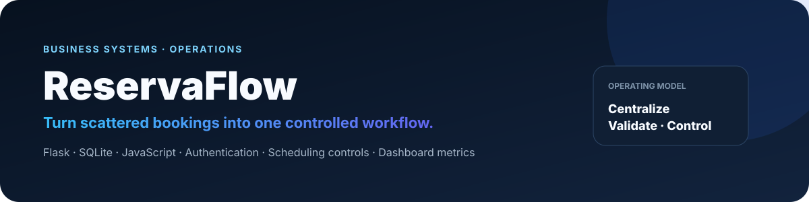
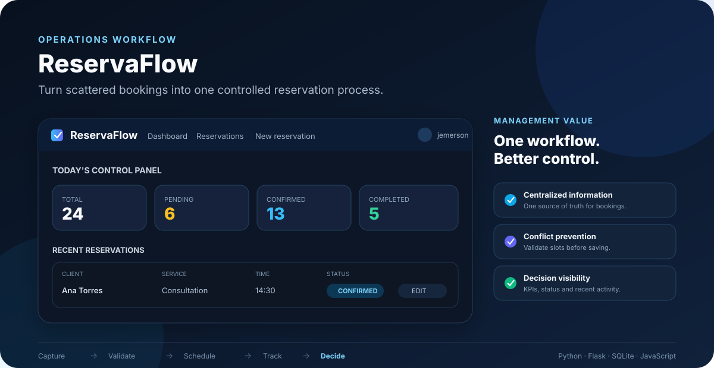
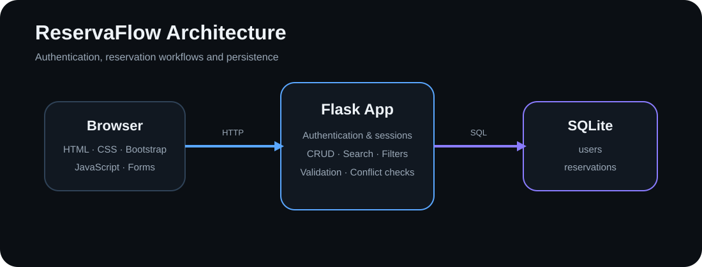

<p align="center">
  
</p>

<p align="center">
  <a href="https://www.python.org/"></a>
  <a href="https://flask.palletsprojects.com/"></a>
  <a href="https://www.sqlite.org/"></a>
  <a href="https://github.com/jtincovalverde/ReservaFlow/actions/workflows/ci.yml"></a>
  <a href="https://cs50.harvard.edu/certificates/33971312-603f-44b5-ae8c-69c073080305"></a>
</p>

## Why this project exists

ReservaFlow was designed around a common administrative problem: **reservations become harder to control when information is scattered across messages, notes or spreadsheets**.

Instead of treating that as only a software exercise, I approached it as an **operations workflow**:

**Scattered information → repeated manual work → weak visibility → higher risk of conflicts and errors.**

ReservaFlow centralizes that process into one system with clear reservation states, validation, search, dashboard visibility and user-level controls.

> **Management idea:** technology is useful when it removes friction, reduces repetitive work or gives the operation better visibility.

## Operations preview

<p align="center">
  
</p>

The visual above summarizes the operating logic behind the project: **capture → validate → schedule → track → decide**. The original application screenshot remains available in `assets/reservations.png`, but this overview is optimized for GitHub so the full concept is visible at a glance.

## What the system improves

| Operational need | ReservaFlow response |
| --- | --- |
| Centralize booking information | One structured reservation workflow |
| Reduce scheduling conflicts | Active-slot conflict prevention |
| Improve control | Search, filters, statuses and dashboard metrics |
| Protect data between accounts | User-level authorization checks |
| Reduce invalid entries | Past-date and scheduling validation |
| Make the workflow easier to manage | Recent reservations and status visibility |

## Core capabilities

- User registration, login and logout
- Secure password hashing
- Reservation creation, editing and deletion
- Dashboard metrics for Total, Pending, Confirmed, Completed and Cancelled reservations
- Recent-reservations overview
- Search by client, phone number or service
- Filter by reservation status
- Prevention of conflicting active reservations at the same date and time
- Validation that prevents reservations in the past
- User-level authorization for edit and delete operations
- Responsive Bootstrap interface with custom CSS
- Browser confirmation before destructive delete actions

## Reservation logic

Each reservation stores:

- Client name
- Phone number
- Service
- Date
- Time
- Status
- Notes

Supported statuses are `Pending`, `Confirmed`, `Completed` and `Cancelled`.

Cancelled bookings do not block their former time slot. When editing a reservation, the application excludes the current reservation from conflict detection so the reservation does not conflict with itself.

Date validation is implemented on both the JavaScript frontend and the Python backend.

## Architecture



The browser communicates with a Flask backend that handles authentication, business rules, validation, reservation workflows and persistence in SQLite.

## Tech stack

| Layer | Technology |
| --- | --- |
| Backend | Python, Flask |
| Database | SQLite, CS50 SQL |
| Templates | HTML, Jinja |
| Frontend | Bootstrap, custom CSS, JavaScript |
| Authentication | Flask Session, Werkzeug password hashing |
| Configuration | Environment variables / python-dotenv |
| Automation | GitHub Actions CI |

## Run locally

1. Clone the repository.
2. Install dependencies:

```bash
pip install -r requirements.txt
```

3. Create the SQLite database:

```bash
sqlite3 project.db < schema.sql
```

4. Copy `.env.example` to `.env` and replace the example secret with your own secure value.
5. Start the application:

```bash
flask run
```

6. Open the local Flask URL and register an account.

The local database, sessions, environment file and Python cache files are intentionally excluded from version control.

## Project structure

```text
ReservaFlow/
├── .github/
│   └── workflows/
│       └── ci.yml
├── assets/
│   ├── architecture.svg
│   ├── reservations.png
│   ├── reservaflow-banner.svg
│   └── reservaflow-preview.svg
├── static/
│   ├── app.js
│   └── styles.css
├── templates/
│   ├── add_reservation.html
│   ├── edit_reservation.html
│   ├── index.html
│   ├── layout.html
│   ├── login.html
│   ├── register.html
│   └── reservations.html
├── .env.example
├── .gitignore
├── app.py
├── requirements.txt
└── schema.sql
```

## Design decisions

I kept reservation status in the same table rather than splitting bookings into separate tables by state. This simplifies transitions and avoids unnecessary duplication.

Active reservations are prevented from sharing the same date and time. This business rule goes beyond basic CRUD behavior and makes the application closer to a real booking workflow.

SQLite was appropriate for the scope because it provides persistent relational storage without requiring a separate database server.

## Next operational improvements

Future versions could add:

- calendar view and configurable working hours;
- different reservation durations;
- customer profiles and staff accounts;
- notifications and exports;
- analytics for demand, occupancy and cancellation patterns;
- resource/staff scheduling;
- deployment to a production environment.

Those improvements would move ReservaFlow from a reservation manager toward a broader **operations and capacity-management system**.

## CS50x

ReservaFlow was submitted as my final project for **CS50x: Introduction to Computer Science** in 2026.

- [Verify CS50x certificate](https://cs50.harvard.edu/certificates/33971312-603f-44b5-ae8c-69c073080305)
- [Watch project video](https://www.youtube.com/watch?v=mBzinlOeNAw)

## AI assistance

ChatGPT was used as a programming assistant and tutor for explaining concepts, reviewing code, discussing project structure and debugging. AI assistance is disclosed here and in the source code.

---

[← Back to my GitHub profile](https://github.com/jtincovalverde)
